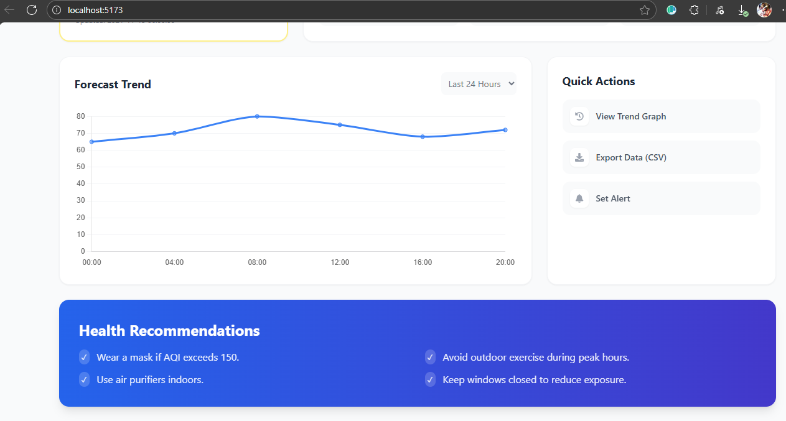
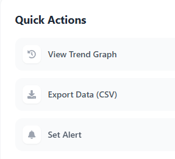

# 🌍 Air Quality Index (AQI) Search Engine

**UI Theme:** Modern Gradient (glass + purple/blue tones)

A lightning–fast, Google-style air quality dashboard built using **Node.js + Express + React + Tailwind**.
Search any city and get real-time AQI, pollutant breakdowns, charts, and environment-risk insights — all inside a clean and modern UI.

---

## 🏅 Tech Badges
<p align="left">
 
 
 
 
 

</p>

## 🛠️ Tech Stack

### Frontend (UI Layer)
* React.js (Vite): Chosen to fulfill the requirement for a front-end layer rendering content using toolsets like React.js.
* Tailwind CSS: Utilized under the freedom to choose your own UI libraries to create a clean look and feel.
* Chart.js: Implemented to meet the bonus requirement of displaying rich information and interesting attributes around air quality.
* Axios: Used to communicate with the backend service.

### Backend (Web Service)
* Node.js & Express.js: Used to develop the Web Service component serving RESTful APIs as specified.
* node-cache: Implements in-memory caching to cache vendor responses, provide speedier results, and handle cache expiry/max entries.
* Axios: Used to fetch details from the external API provider.

---

## 📸 Screenshots / Project Images


| Dashboard Preview | Pollutant Modal | Features |
|-------------------|---------------|------------------|
|  |  |  |


---

## 📁 Project Structure
```
aqi-search-engine/
 ├─ server/
 │  ├─ src/
 │  │  ├─ controllers/
 │  │  ├─ services/
 │  │  ├─ routes/
 │  │  └─ utils/
 │  ├─ .env.example
 │  └─ package.json
 ├─ client/
 │  ├─ src/
 │  │  ├─ App.jsx
 │  │  └─ main.jsx
 │  ├─ public/
 │  │  └─ index.html
 │  └─ package.json
 └─ README.md
```

---

## 🧪 API Endpoint
```
GET /api/aqi/:city
```
Returns: AQI, pollutant breakdowns, recommendations & coordinates.

---
## 🔌 Backend — API Documentation (Server: `server/`)

### Base URL (local)
```
http://localhost:5000/api
```

### Authentication to external API
We use the **AQICN (World Air Quality Project)** API. Get a token from https://aqicn.org/api/
Place your token in the server `.env` file as `AQI_API_TOKEN`.

Example `.env` (server/.env):
```
PORT=5000
AQI_API_TOKEN=your_aqicn_token_here

```

### Endpoint: Get AQI by city
```
GET /api/aqi/:city
```
- `:city` path param — required. Use city name or location slug (e.g., `mumbai`, `new york`).
- Response is JSON with AQI, pollutant breakdown, coordinates, timestamp, and cache metadata.

#### Query example (curl)
```bash
curl "http://localhost:5000/api/aqi/mumbai"
```

#### Successful response (200)
```json
{
  "city": "Mumbai",
  "station": "Mumbai - Colaba",
  "aqi": 142,
  "category": "Unhealthy for Sensitive Groups",
  "dominantPollutant": "pm25",
  "coordinates": { "lat": 18.9220, "lon": 72.8347 },
  "pollutants": {
    "pm25": 142,
    "pm10": 88,
    "no2": 54,
    "so2": 18,
    "o3": 40,
    "co": 12
  },
  "health_insights": "Sensitive groups should reduce prolonged or heavy exertion.",
  "timestamp": "2025-02-11T12:45:00Z",
  "cached": true
}
```

#### Error responses
- `400 Bad Request` — Missing or invalid city param.
- `404 Not Found` — No data available for the requested city.
- `502 Bad Gateway` — External API returned an error/unavailable.
- `500 Internal Server Error` — Unexpected server error (check server logs).

#### Implementation notes (server side)
- The backend **proxies** requests to AQICN: `https://api.waqi.info/feed/{city}/?token=TOKEN`.
- The server **parses** the vendor response and returns a simplified, consistent JSON shape for the frontend.
- The server handles rate-limiting errors from AQICN and surfaces a `502` with a user-friendly message.

---

## 🧠 Caching Strategy (as required)
A caching layer is implemented to reduce calls to AQICN and improve performance for repeated queries.

**Parameters (configurable via env):**
- `CACHE_MAX_ENTRIES` (default: 50) — maximum number of city entries in cache.
- `CACHE_TTL_MINUTES` (default: 30) — how long an entry stays valid.

**Behaviour:**
- On `GET /api/aqi/:city`, the server first checks the cache:
  - If a **valid** cached entry exists (not expired) → return cached response with `cached: true`.
  - If not found or expired → fetch from AQICN, store transformed response in cache, return with `cached: false`.
- Eviction policy: **Least Recently Used (LRU)** or FIFO depending on implementation – recommended: LRU for real workloads.
- Cache stored in-memory by default; the code is abstracted so swapping to Redis is straightforward (just replace the cache adapter).

Edge cases handled:
- Cache miss + external API failure → return `502` and **do not** write to cache.
- If cache is full, evict least recently used entry before inserting new one.
- TTL countdown starts at moment of successful external API fetch.

---

## ⚙️ Frontend (`client/`)
- Built with React (Vite) and TailwindCSS for rapid dev and responsive design.
- Main features:
  - Search box with debounce (300ms) and simple client-side suggestions.
  - AQI card showing numeric AQI, color-coded category (Good→Hazardous), and dominant pollutant.
  - Pollutant breakdown (PM2.5, PM10, NO₂, SO₂, O₃, CO) with a bar chart (e.g., Chart.js or Recharts).
  - Timestamp & station info.
  

---

## ✅ Edge Cases & Error Handling (frontend + backend)
- Empty search → show inline hint `Please type a city name` (400-level UX feedback).
- Unknown city → show `No data found for "CITY"` (maps to backend 404).
- External API rate limit exceeded → show user-friendly message: `External service temporarily unavailable. Try again later.`
- Partial data (some pollutant keys missing) → render available keys and show `—` for missing values.
- Network offline → frontend detects `navigator.onLine === false` and shows `You appear offline.` hint.


## 🔧 Run Locally

### 1️⃣ Backend
```
cd server
npm install
```

Copy `.env.example` to `.env` and fill your token:
```
PORT=5000
AQI_API_TOKEN=your_api_token
```

Start:
```
node src/app.js
```

### 2️⃣ Frontend
```
cd client
npm install
npm run dev
```

Open: `http://localhost:5173`

---


## UI Templates and Widgets
https://www.aqi.in/aqi-widget , 
https://purecode.ai/

## 📜 License
MIT — free to use and modify.
