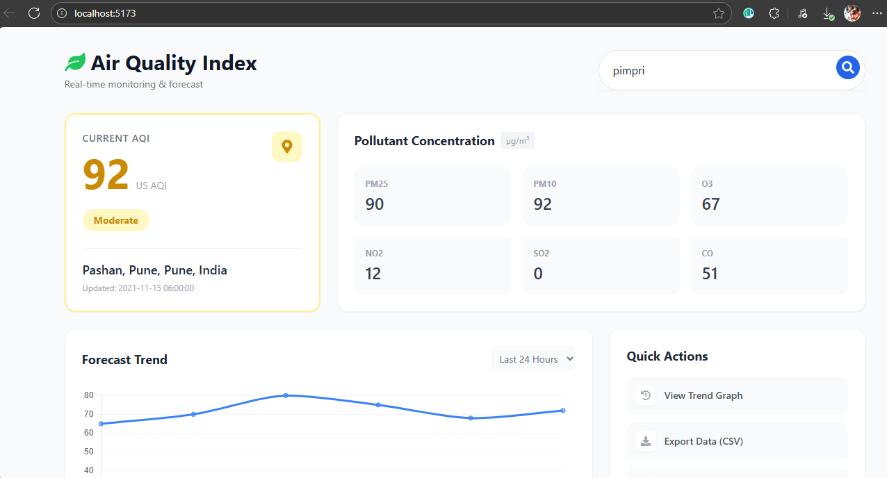

# 🌍 Air Quality Index (AQI) Search Engine

**UI Theme:** Modern Gradient (glass + purple/blue tones)

A lightning–fast, Google-style air quality dashboard built using **Node.js + Express + React + Tailwind**.
Search any city and get real-time AQI, pollutant breakdowns, charts, and environment-risk insights — all inside a clean and modern UI.

---

## 🏅 Tech Badges
<p align="left">
 
 
 
 
</p>

---

## 🚀 Live Demo
🔌 Backend: https://your-backend-url.com  
🎨 Frontend: https://your-client-url.com  
⚠️ Make sure backend is running before opening the frontend.

---

## 🌈 Repository Banner
*(Optional)*  
``

---

## 📸 Screenshots / Project Images

Example gallery (replace with your links):

| Dashboard Preview | Search Screen | Pollutant Modal |
|-------------------|---------------|------------------|
|  |  |  |

**Tip:** GitHub will render images on the README automatically when you push the files. You can also use relative paths to images stored in `/client/public/screenshots/`.

---

## 📁 Project Structure
```
aqi-search-engine/
 ├─ server/
 │  ├─ src/
 │  │  ├─ controllers/
 │  │  ├─ services/
 │  │  ├─ routes/
 │  │  └─ utils/
 │  ├─ .env.example
 │  └─ package.json
 ├─ client/
 │  ├─ src/
 │  │  ├─ App.jsx
 │  │  └─ main.jsx
 │  ├─ public/
 │  │  └─ index.html
 │  └─ package.json
 └─ README.md
```

---

## 🧪 API Endpoint
```
GET /api/aqi/:city
```
Returns: AQI, pollutant breakdowns, recommendations & coordinates.

---

## 🔧 Run Locally

### 1️⃣ Backend
```
cd server
npm install
```

Copy `.env.example` to `.env` and fill your token:
```
PORT=5000
AQI_API_TOKEN=your_api_token
```

Start:
```
node src/app.js
```

### 2️⃣ Frontend
```
cd client
npm install
npm run dev
```

Open: `http://localhost:5173`

---

## 📜 License
MIT — free to use and modify.